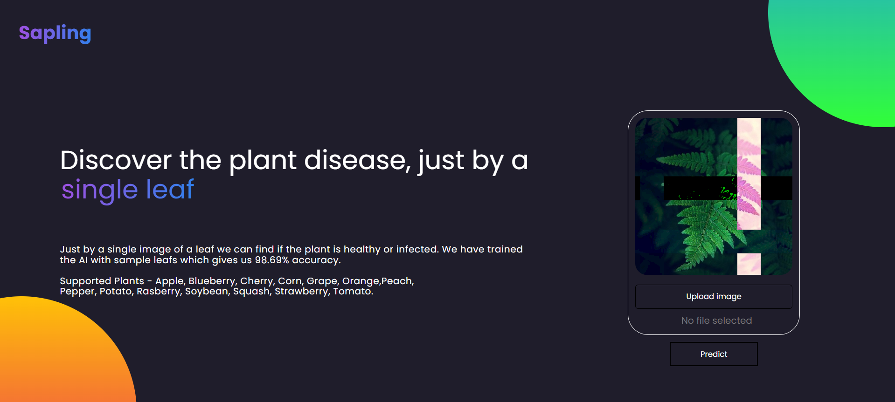
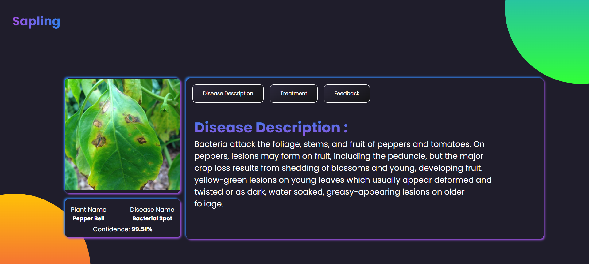
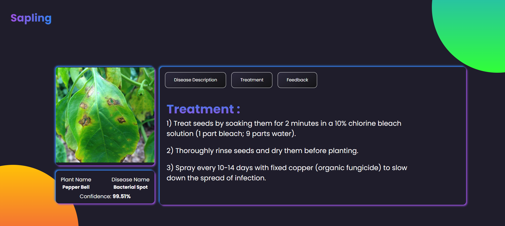
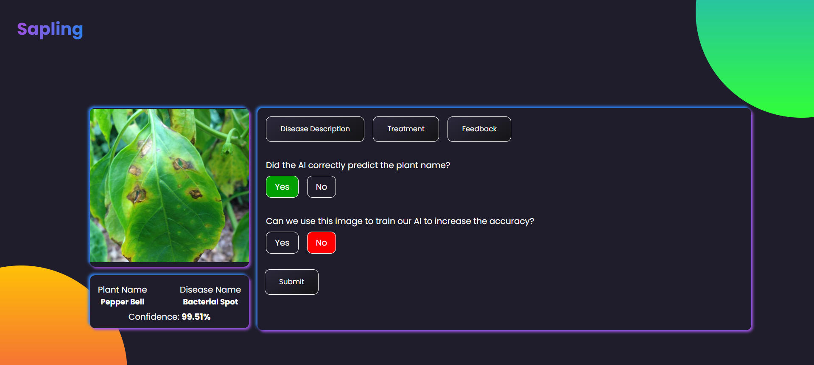
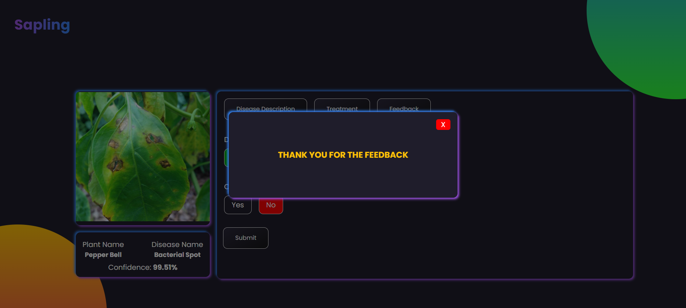

# Plant Disease Detection
Plant Disease Detection is a web-based application leveraging React for the frontend and Python (FastAPI, PyTorch) for the backend. It uses an SVM-trained machine learning model to identify plant diseases from images, providing farmers and researchers with accurate, real-time diagnostics for better crop health management.


## Run Python Model 

```bash
  cd API
```

```bash
  uvicorn main:app --reload
```

## Run React App

```bash
  cd sapling
```

```bash
  npm i
```

```bash
  npm start
```

## Screenshots
**Home Screen**




**Disease Description**




**Treatment**




**Feedback Form**




**Feedback Acknowledgement**



